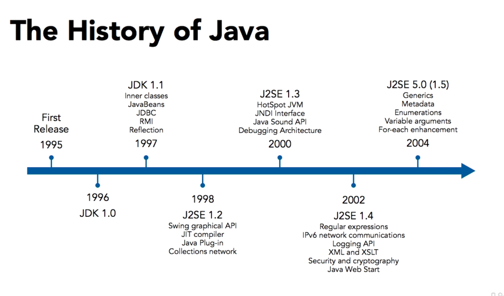
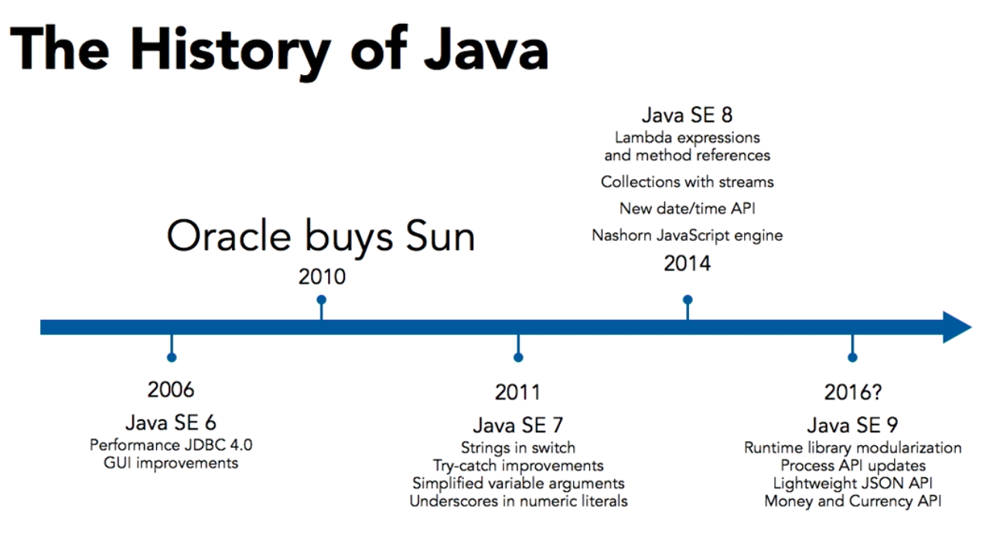

# Type inference from Java 11 Version

```java
// Without type inference
int number = 5;
Object myObj = new Object();

// With type inference
var number = 5;
var myObj = new Object();
```

Note: seeing the new course: Migrating beyond Java 8.

Java SE: Standard Edition. 
Java EE: Enterprise Edition

see: https://newrelic.com/resources/report/2023-state-of-the-java-ecosystem





static: means that the method can be called directly from the class definition rather than from an instance of the class. 

## Abbreviation

JRE: Java Runtime Environment 
JDK: Java Development Kit

## Identifier Conventions

- Classes start with uppercase characters. ```class MyClass```
- Methods and variables start with lowercase characters ```public void doSomeThing(String value) {}```
- Constants are all uppercase ```public static final String COMPANY = "some company";```

## Memory Management and Garbage Collection

Explicitly dereference variables with null keyword.

```java
String value = "Some String";
value = null;
```

**System Methods**

Method System.gc() and Runtime.gc() can request garbage collection , but is not a guarante it will happen. 

If memory is no available for newly requested object system throws ```OutOfMemoryError```

## Selecting SDK in IntelliJ IDEA 

1 - Configure > Project Defaults > Project Structure > SDKs > + 

2 - Selecting: /Library/Java/JavaVirtualMachines/sdk folder

3 - Project SDK and Project Language Level with Lambdas, type annotations etc.

