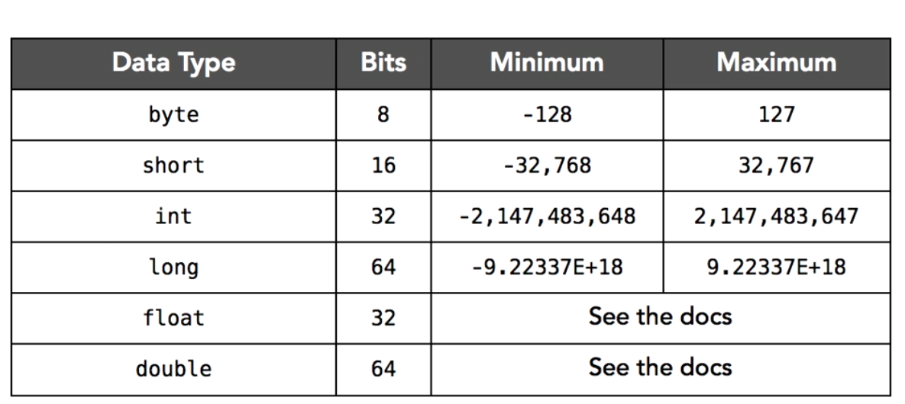
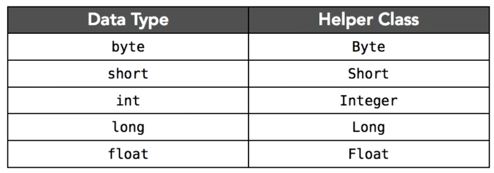
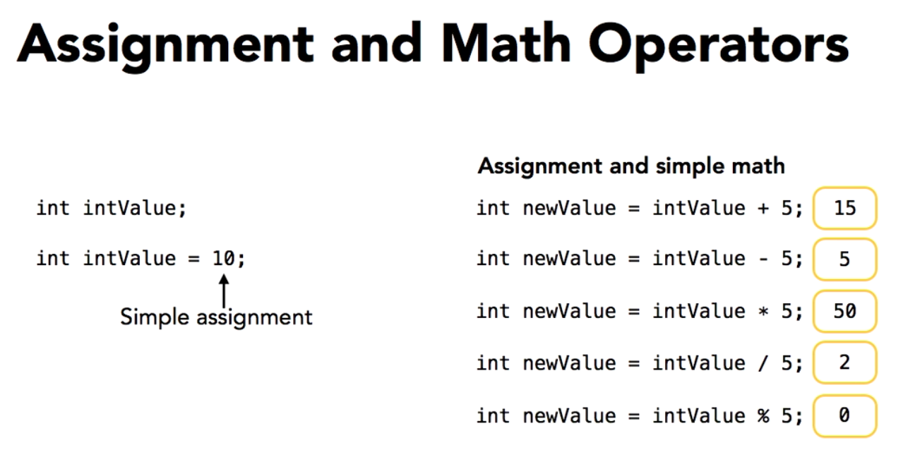
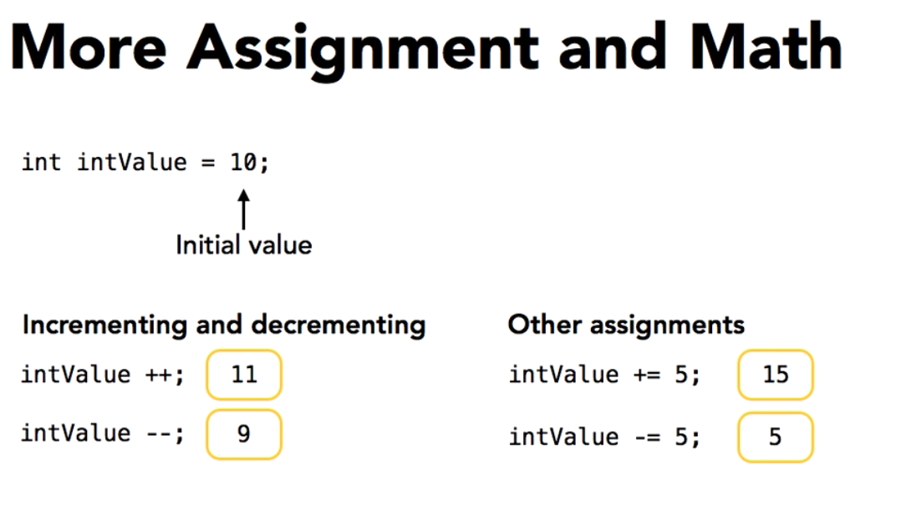

# Working with variables

There are two major classes of variables or data types in java known primitives and objects.

Primitive data types are all lowercase.

String is not a primitive, is complex object. 

Java is a statically typed language.

All variables must have their types declared.

**Primitive number**
All primitive variable are starting by 0; default;



**Helper Classes**

Are part of Java Runtime Library, Each of these classes can be used for converting values from one primitive data type to another and to formart value 



Helper Classes Package: java.lang.HELPER CLASS NAME

```java

import java.lang.*;

public class Main{
    public static void main(String[] args){
        double doubleVal = 150.25;

        // Convert to another values
        Double obj = new Double(doubleVal);

        // To Float
        float fPrimitive = obj.floatValue();

        // To Int 
        int iPrimitive = obj.intValue();

        // To String
        String sObj = obj.toString();
    
    }
}

```

- Byte.MAX_VALUE: returns the maximum value of a byte variable.

Note: If you exceed the maximum value with a primitive data type, you'll always wrap around to the minimum value and that'll be true for all the primitive data types. 

## Representing currency values with BigDecimal.

Is a class in java that provides operations on arbitrary-precision decimal number. 

**Methods**

- .add(BigDecimal obj);
- .subtract(BigDecimal obj)
- .divide(BigDecimal divisor, int scale, RoundingMode roundingMode)

- .compareTo(BigDecimal val): Compares this BigDecimal with the specified BigDecimal 

// 1 if num1 > num2, -1 if num1 < num2, 0 if equal

- .setScale(int newScale, RoundingMode roundingMode)

- .negate() Returns a BigDecimal whose value is the negation of this BigDecimal.

- .abs() Returns a BigDecimal whose value is the absolute value of this BigDecimal.

- .pow(int n) Returns a BigDecimal whose value is (this<sup>n</sup>).

- .toString() Converts this BigDecimal to a String.


```java

import java.math.BigDecimal;

public static void main(String[] args) {
    try {
        BigDecimal object = new BigDecimal("58.50");

        System.out.println("Current value => "+ object.intValue());
    }
    catch (NumberFormatException e){
        System.out.println("Big Decimal value is wrong!!");
    }
    finally {
        System.out.println("Always for here papa");
    }
}

```

**Narrowing the type** When you going from a larger to smaller. For example, when you cast a value to another is possile lost data

```java
public static void main(String[] args){
    double dNum = 3.142568d;
    int iNum = (int) dNum;

    System.out.println("Value is: "+iNum); // 3
}
```

## Using mathematical operators and the Math class

source: https://docs.oracle.com/javase/8/docs/api/java/lang/Math.html

The Maths class contains methods for performing basic numeric operations such as the elementary exponential, logarithm, square root, and trigonometric functions. 

## Working with Boolean values and expressions. 

```java
boolean value = true or false;

// Helper class
Boolean xx = new Boolean();

String some = "true";

boolean value = xx.parseString(some);
```

## Working with character values 

Java distinguishes between characters and strings, a character is a primitive Data Type and it consists of just single character and on the other hand string is a Complex Object. 

Literal for characters are always wrapped in single quotes.

Note: You can use unicode for represent characters. 

Helper Class: Character

```java
char x = 'j';

System.out.println("Out -> "+ Character.toUpperCase(x));
```

## Using Java Operators

- instanceof : to ask whether an object is.

```java
String some = "Hello world";

if(some instanceof java.lang.String){
    System.out.println("Is a string");
}
```




