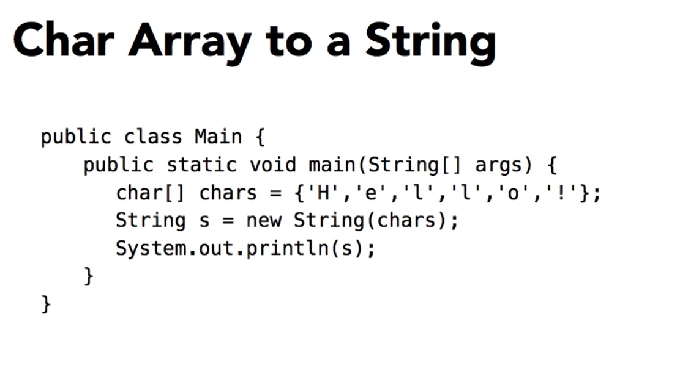

# Working With Objects

- An object is an instance of a class.
- Noprimitive variables are reference to objects.
- Object can have multiple references. 

**Class has three important part**

- Instance variable: also is known as field, is not a member of the class itself, its a member of an instance of the class.
- Instantiation: when a class is istantiated.
- Instance method.


**String Class**

Package: import java.lang.String; it is optional.

- String is a collections of characters in a particular order.
- String ara inmmutable. Is possible change, but the change has another memory reference. 
    - Resetting the value of a String creates a new object. 

```java
String obj = new String("OK");
String obj = "OK"; // Shortcut.

// Them are the same, 

```



## Using the String class

**Concatenating values** refers to combining multiple values or strings together to form a single, longer string. This is often done using a concatenation operator, such as the plus sign (+).

- .toCharArray() : returns an array of char primitive type.

```java
String obj = new String("Hello world");
char[] list = obj.toCharArray();

for (char c : list ){
    System.out.print(c);
}
```

## Converting primitive values to String

Its is simple, you must use Helper Classes.

Note: The use of underscores as separator in your code, was intruduced in Java 7 and it makes it much easier to look at long numeric values. 

```java
// Using heler classes.

int num = 78;
String strNum = Integer.toString(num);

boolean flag = true;
String strFlag = Boolean.toString(flag);

long bigNumber = 58_485_478;
FormatNumber formatter = FormatNumber.getNumberInstance();
String strBigNumber = formatter.format(bigNumber);

```

**NumberFormat class**

Package: import java.text.NumberFormat;

## Building a String from multiple values or StringBuilder

Note: simple concatenation can cause problems in memory management. ```str + str2 + str5 + str9```

Package: import java.lang.StringBuilder; it is optional.

StringBuilder is used for creating and manipulating String more efficiently than used String Class. it is mutable. 

Reducing the overhead of creating multiple String objects. 

Buffer for text content: useful in scenarios like reading file or network when you need to append data to string buffer.

**Popular Methods**

- ```.append(String str)``` appends the specified string to this sequence.

```java
StringBuilder sb = new StringBuilder();
sb.append("Hello");
sb.append(" World");
// sb.toString() -> "Hello World"
```

- ```.insert(int offset, String str)``` inserts the specified String at the specified position.

```java
StringBuilder sb = new StringBuilder("Hello");
sb.insert(5, " World");
// sb.toString() -> "Hello World"
```

- ```.delete(int start, int end)``` removes the characters in a Substring of this sequence. 

```java
StringBuilder sb = new StringBuilder("Hello World");
sb.delete(5, 11);
// sb.toString() -> "Hello"
```

- ```.deleteCharAt(int position)``` removes the character at the specified position.

```java
StringBuilder sb = new StringBuilder("Hello");
sb.deleteCharAt(4);
// sb.toString() -> "Hell"
```

- ```.replace(int start, int end, String str)``` replaces the characters in substring of this sequence with the specified String.

```java
StringBuilder sb = new StringBuilder("Hello World");
sb.replace(6, 11, "Java");
// sb.toString() -> "Hello Java"
```

- ```.reverse()``` reverses the sequence of characters.

```java
StringBuilder sb = new StringBuilder("Hello");
sb.reverse();
// sb.toString() -> "olleH"
```

- ```.toString()``` convers the StringBuilder object to String.
- ```.length()``` returns the length of the squence. (characters count)

- ```.setLength(int newLength)``` set new length of the characters.

```java
StringBuilder sb = new StringBuilder("Hello World");
sb.setLength(5);
// sb.toString() -> "Hello"

```

- ```.charAt(int index)``` returns ```char``` value at the specified index.

```java
StringBuilder sb = new StringBuilder("Hello");
char ch = sb.charAt(1);
// ch -> 'e'
```

- ```.substring(int start, int end)``` returns a new ```String``` that contains a subsequence of characters currently contained in the character sequence. 

```java
StringBuilder sb = new StringBuilder("Hello World");
String sub = sb.substring(6, 11);
// sub -> "World"
```

### Scenarios for using StringBuilder

1 - Frequent concatenation 

2 - Dynamic String Construction: When constructing complex strings dynamically, such as building SQL queries, constructing JSON/XML data, or generating HTML content.

```java
StringBuilder query = new StringBuilder("SELECT * FROM users WHERE");
if (someCondition) {
    query.append(" age > 21");
}
if (anotherCondition) {
    query.append(" AND status = 'active'");
}
String sqlQuery = query.toString();
```

3 - Buffer for text content

```java
BufferedReader reader = new BufferedReader(new FileReader("file.txt"));
StringBuilder sb = new StringBuilder();
String line;
while ( (line = reader.readLine()) != null ) {
    sb.append(line);
    sb.append(System.lineSeparator());
}
String fileContent = sb.toString();
```

**Reasons to Use StringBuilder Over String**

1 - Performance
2 - Memory Efficiency 
3 - Convenience Methods

**Checking position**

```java
public static boolean isValidPosition(StringBuilder sb, int position) {
    return position >= 0 && position < sb.length();
}

// at main
sValidPosition(sb, 5);
```