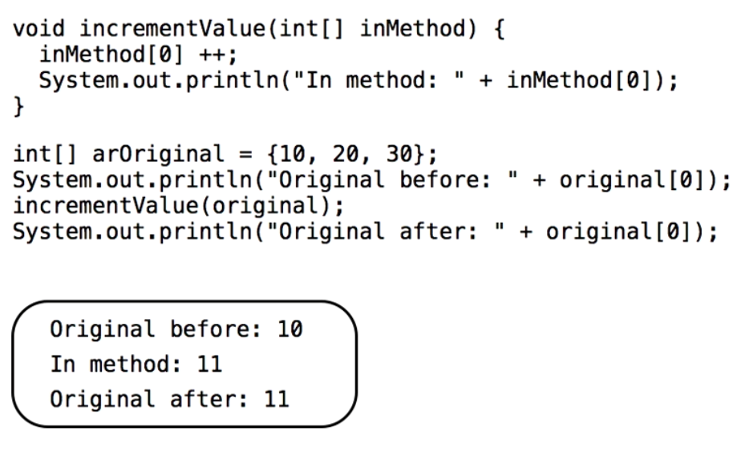
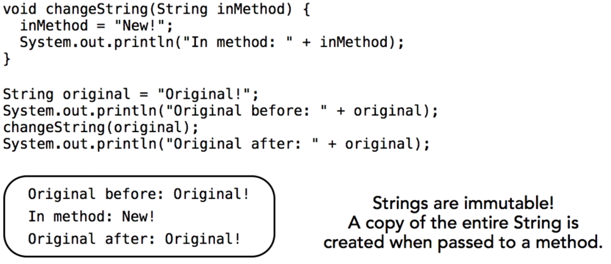

# Programming Conditional Logic

- if, else, if else
- switch

## Creating Looping Code Blocks

- Incrementing Loop `for(int i = 0; i < ary.length; i++)`: it has three statements between parenthesis, the first declare a counter variable, the seconds is a condition and the loop will continue as long as condition is true. And the third part is the incremental statement

- For Each `for(String item : items)` the first statements is the data types that matches the items in the array. 

- while(condition){}
- do {} while(condition);

## Creating Reusable code with Methods

```java
public static void main(String[] args){
    someMethod("FIRST ONE");
    someMethod("SECOND ONE");
    someMethod("THIRD ONE");
}

private static void someMethod(String label){
    System.out.println(label);

    for(int i = 0; i < label.length(); i++){
        System.out.print("*");
    }

    System.out.println("");
}
```

## Overloadig Methods with Different Signatures

You can create more than one version of a method, you just have to distinguish them from each other by number of arguments or argument data types. 

- Methods with arguments with three dots: "..." that means that the user can pass in as many value as they want.

```java
static public double getValues(String ... items){
    double result = 0;

    // Using For Each Loop
    for(String item : items) {
        double val = Double.parseDouble(item);
        result += val;
    }

    return result;
}
```

## Pasing Arguments by Copy or by Reference

- Passing to a method by copy
    - The method receive a copy of the variable

- Passing to a method by reference
    - The method receive a reference to the original object.

Note: In java variables are always passed by copy. 

### Primitive Wrapped in Object 



Note: Array is complex value and it saves the object item reference, because it change like reference. 

### Object variables are References

- A reference variables points to a location in memory.

- When a variable is passed to a function, a new reference is always created.

- Both references points to the original objects or values. 

### Passing String values, it never change because is inmmutable

